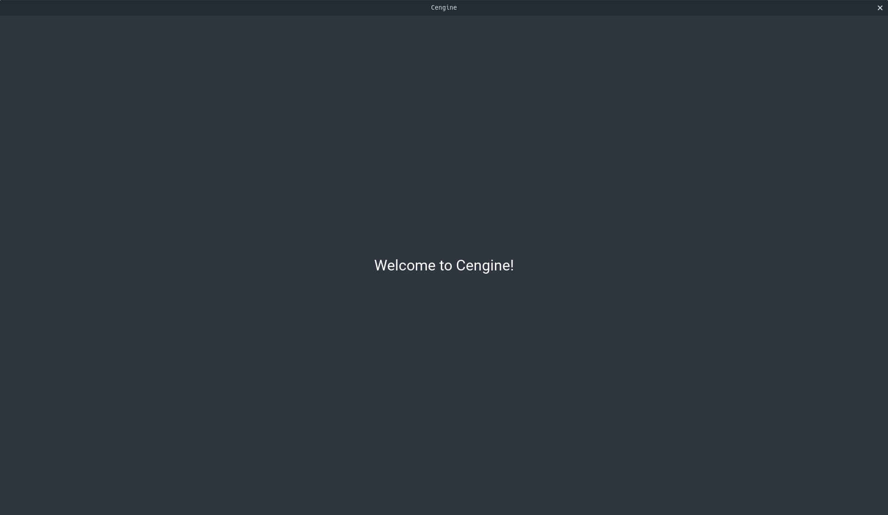

# Get Started

## 1. Install Dependencies

Your first need to install some dependencies to correctly compile **cengine** source code.

### Pthreads

If the pthreads library is not installed on your system, install it (in Ubuntu) by running:

`sudo apt-get install libpthread-stubs0-dev`

### SDL2

- libsdl2-dev - Simple DirectMedia Layer development files
- libsdl2-image-dev - Image loading library for Simple DirectMedia Layer 2, development files
- libsdl2-ttf-dev - TrueType Font library for Simple DirectMedia Layer 2, development files

In Ubuntu you can simply install the packages from the repos by typing:

`sudo apt-get install libsdl2-dev libsdl2-image-dev libsdl2-ttf-dev`

## 2. Download Cengine Source Code

You can donwload **cengine's** latest source from this repo. If you want the latest rolling release in master, you can git clone in the master branch. However if you want the latest stable version, please refer to the releases tab in this repo and select the version you want.

## 3. Get Welcome Example Running

Now that you have **cengine's** source code, you can try running the base example.

Let's start with a little explanation on the source code layout. You need to focus in two main directories, the src and the include one.

- src -> this is where all the .c source files are located. They are divided into different categories (modules)
- include -> this is where the .h header files are located. They are divided in the same categories with matching names as the ones located in the src directory

In addition, you will also find the assets folder, whith some **cengine** default assets, you can use them in or your project or not.

Finally there is the examples directory, where you will find some examples to get you started.

We will focus on compiling the welcome example (welcome.c). To do this, first we need to compile the cengine library into a shared object (.so). The are three basic commands for the Makefile:

The are three basic commands for the Makefile:

| Command        | Description   |
| -------------  |:-------------:|
| make           | Compile cengine's source code into a shared object (.so)          |
| make examples  | Compile the examples using the newly created cengine.so           |
| make clean     | Clean created objects (.o files) and binaries                    |

Run the example, after the compiling cengine, like this:

`LD_LIBRARY_PATH=bin/ ./examples/bin/welcome`

You should see that a window like this gets created:

## 4. Create Awesome Apps

Now you can start creating your own app/game using **cengine**. Feel free to navigate to the documentation and other tutorials in **cengine.ermiry.com** to get a better understanding on how **cengine** works and how to get the most of it.

Examples are updated constantly and are all open source, you can check them to see the awesome things that can be accomplished.

If you find any bug in **cengine** code, feel free to open a bug ticket explaining the problem and please include any screenshot you think can help or even code that can be used to replicate your issue.

You can also make changes to the source code an open a pull request if you want your code to be part of **cengine**.

Finally, be sure to check the devblog at **cengine.ermiry.com** for any important changes that happen to **cengine**.

Happy coding, 
Erick Salas
